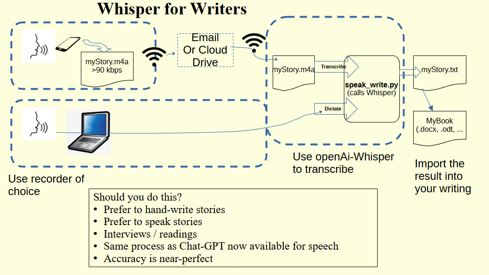
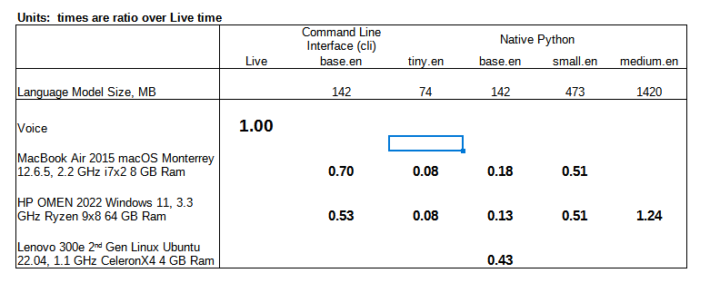

# Whisper for FWG
Whisper-for-FWG is a wrap of OpenAI's Whisper program, a speech-to-text transcribing program.   We attempt to make it a one-click process, so you can concentrate on your writing.  By using native python the speed of this wrapped version is the fastest software possible.  There are a lot of instructions out 'there' to run 'whisper' using a command line interface (cli) which is 4 times slower than the native python approach.

There are hardware approaches that will make it faster  - 'cuda' package for NVIDIA GPUs.   This wrapper does not support that.   I tried on a new HP OMEN gaming PC without success.

Phones are not capable now of running these tools.   This is a matter of practicality.   I'm sure in ten years the average phone will transcribe real time.  This tool is a stop gap.

The underlying neural
networks are the same as used for OpenAI's Chat GPT, a famous first example of the new generation of practical AI.

For installation, you either use GitHub desktop app to install or you click on the green '<> Code' box above to download a zip file (easiest).  [source](https://github.com/davegutz/fwgWhisper).   Move into the folder 'Documents/GitHub'

# There are instructions for each platform
Before going there, download the source code now because it's right at the top of this page:  click on the green box titled '<> Code' and 'Download ZIP' file.   Of course, you should skip this step is planning to use the 'GitHub Desktop App'.  Coming back here and locating the download will be difficult later and easy now.   The installation will explain what to do with the '.zip' file.

[macOS](doc/FAQ_macos.md)

[Windows](doc/FAQ_windows.md)

[Linux](doc/FAQ_linux.md)

# There are special developer instructions if desired
[Special Developer Instructions](doc/DEVELOPER.md)

## Approach

We're wrapping an existing tool to make it easy for non-tech people to use.  After installation, only mouse clicks are required to enjoy using it.

The existing tool, 'whisper,' requires installation of python.   So knowing that python must be installed, this tool comes as a python package.   Download this package, install python3.10 and higher, run pip as instructed herein, and it should work from the command line.   You can finish with a flourish by making a shortcut to the command line command.

Supposedly 'whisper' works on 3.6 - 3.9 but these wrapper scripts have problems with those, in the area of the 'tkinter' functions.

For background, here's the [whisper README](Whisper-README.md), choc full of nuts.

[or online](https://github.com/openai/whisper)

I don't yet explain how to record audio and get it onto your computer to be available for whisper.  I like the open-source package [audacity.](https://www.audacityteam.org/)  It is available in the Microsoft Store and the Ubuntu repository.  Download .dmg for macOS.   You will need to install the 'ffmpeg' extension. 

## Testing
I ran the wrapped 'whisper' tool on three different laptops I have:  a MacBook Air from 2015, a gaming HP OMEN running Windows 11 from 2022, and a tiny Lenovo running Linux from 2022.   I recorded a vignette I wrote using Audacity on the HP machine.  That package has the capability to save in any format that 'whisper' accepts and for different resolutions.  '.wav' is lossless and has very large size.   '.mp3' and '.m4a' are two common lossy formats that lose high frequency tones.  I ran a variety of down-sampled, as well as the original raw '.wav' through 'whisper' with a range of language models.   I used only English.   So, holding the recording constant, I generated a test matrix to evaluate the tools.

The above figure shows the effect of down-sample resolution on Word Error Rate (WER).   Processing times are relative to the live recording.   Nearly all transcription was faster than real time.

The above figure shows the effect of language model on processing time, ratio of live time.   Sizes and times go up exponentially with capability.

The above figure shows the effect of computer.  Even the smallest available 64-bit computer, so small only Linux would run on it, does a reasonably timely job transcribing.  Whisper is running in a single thread.  Run times are at the mercy of clock speed.  In theory, 'whisper' will run with GPUs.   The HP Ryzen 9 is a gaming PC with NVIDIA GPU cards that are supposed to be compatible.   I could not figure out how to get 'whisper' to use it.   But really not needed for the writing task.

The command-line-interface (cli) is four times slower.   Use Native Python provided with this tool.

## Recommendations
1. Record in mono.   Sound quality is fine.  I used these [Audacity](doc/INSTALL_audacity.md) instructions.
2. Any audio file format will work.  '.wav' tends to have the largest file sizes by a factor of 5.   Formats 'mp3' and 'm4a' work fine.
3. 'Whisper' appears to down-sample (low-res mp3 results are as good as lossless wav).   Therefore, low audio resolution works fine and keeps sizes small, mp3 48 kbps.
4. When running the tool, avoid the 'tiny.en' model.   The 'base.en' model runs almost as fast and with half the error rate.   The 'small.en' model runs about half of live and slightly better error rate than 'base.en' but may not be worth the time spent.   The 'medium.en' model is nearly perfect and takes about the same amount of time it did to record.  Consider your needs:  it may be worthwhile to run your transcriptions overnight.
5. For recording, either phone or computer is good enough sound quality.
6. For transcribing, even a low-end computer will suffice.  Phones do not support this type of calculation.
7. Use the native Python tool, this one, instead of the cli versions that are commonly discussed in the forums.  The results are identical and the native version is four times faster and worth the effort to install Python.
8. Be warned that these results were made indoors in a quiet setting.   Be cautious in coffee shops and autos.   I wouldn't want you to dictate a novel there only to discover it did not transcribe.

## Closing notes
It is well known that reading improves writing, and writing improves comprehension.   Likewise, writing should improve by speaking.   Perhaps we're advancing backwards to an oral tradition.

## License
fwgWhisper's code are released under the MIT License.
See [LICENSE](https://github.com/openai/whisper/blob/main/LICENSE) for further details.
