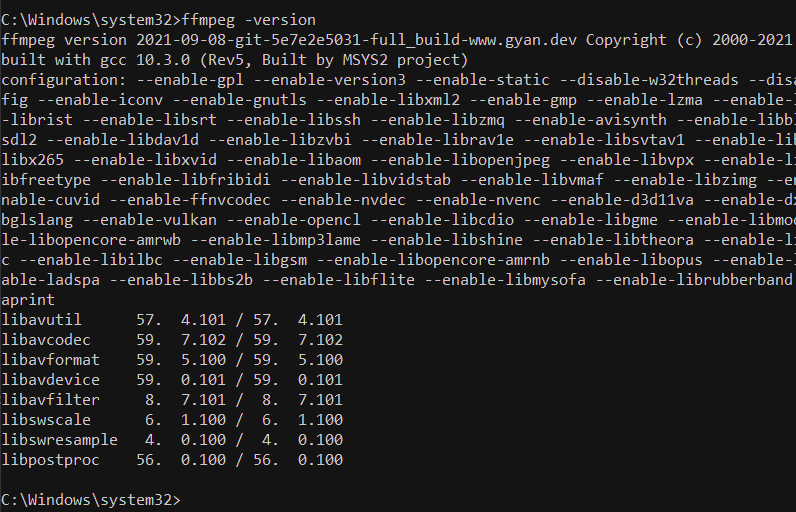

# INSTALL for Windows 'whisper'
[Back to Windows](FAQ_windows.md)

[Back to top](../README.md)

Synopsis:  Download this repository.   Put it in Documents/GitHub folder.
Download and install ffmpeg.   Download and install python3.10.10.  Use 'pip' and 'pip3' from
'python3.10' to install dependencies 'configparser' and 'openai-whisper' respectively.  The paths will get set automatically to point 'python' at 'python3.10'.
Start Google Drive if installed.  Then run 'whisper_to_write.py' using 'python'

Be sure that your user account name has no spaces before starting this.   If it does, change it now.   Go to 'Control Panel - User Accounts - Change the account name'

## Download the repository [myWhisper](http://www.github.com/davegutz/myWhisper)
For most people it's easiest to click on the green '<> Code' box and download the '.zip' file.  Extract to Documents/GitHub.  Make that folder if you need to.  When done, there will be a folder similar to 'myWhisper-beta' where 'main' refers to the Current Branch in GitHub.  Install and use [NanaZip](https://apps.microsoft.com/store/detail/nanazip/9N8G7TSCL18R?hl=en-us&gl=us&rtc=1)

If you're so inclined, use the GitHub desktop app to perform this download.  If you don't know what I'm talking about, use the method above.

### Install _ffmpeg_

TODO:  Try using pip in PyCharm first:  _ffmpeg-python_

If that doesn't work go on to the following.  TODO:  Update these instructions.

[(for reference)](https://www.geeksforgeeks.org/how-to-install-ffmpeg-on-windows/)  A geek site.  It sends you to the next link.

[Click her to download the latest ffmpeg](https://www.gyan.dev/ffmpeg/builds/ffmpeg-git-full.7z)  This is what you need.

Now in your 'Downloads' folder, unzip this folder:
- right-click on it.   If there is no 'extract here' option you will  need to install an archive manager.   In your start search box type 'nanazip' and let Windows guide you to the 'Store' to 'Get' it.   Once it is installed, right-click again and at the top you will see 'NanaZip'.
- Click on the extractor and select "Extract to 'ffmpeg....-full_build\"
- Rename the extracted folder to 'ffmpeg'.  You can do this easily by right-clicking on that new folder and select 'rename'.
- Move this folder to C:\.    Right-click on 'ffmpeg' and select 'Cut'.  On the 'file explorere' menu find 'C:\' and left-click on it.  Right-click and select 'Paste'.
- Open an administrator 'PowerShell', 'Terminal', or 'Cmd' shell and run

```
setx /m PATH "C:\Users/user_name/ffmpeg\bin;%PATH%"
```
- Finally restart your computer.   Reopen the shell and type

```ffmpeg -version```

It should return something that looks like




### Install python3
'python3.10.10' is what I used to develop these instructions.  You can use 3.6. - 3.11

1. See what you have:  Open a PowerShell or CMD shell.   Type  `python3` then if that is blank try `python`.   It will say which version in the first line.  You need 3.10 or greater.  Type `ctrl-z` and possibly `ENTER` to exit the python shell.
2. Go to the [python website](https://www.python.org/downloads/) and get 3.10.10.
3. Double-click on the python<>.exe file in Downloads
4. Check 'Add python.exe to PATH' option.   If this is the first install of a python3 it will exist as 'python3' otherwise as 'python3.10'

## Install the dependencies using 'pip'

Use the pip built into PyCharm Interpreter setup to add _openai-whisper, pydub, pvrecorder, pyaudio_

Alternatively open a non-administrative Power Shell, Terminal (Win 11), or Cmd and run the following anywhere (use 'python3' if needed from previous step).
```commandline
python -m pip install --upgrade pip
python -m pip install configparser
python -m pip install openai-whisper --default-timeout=1000
python -m pip install pydub
python -m pip install pvrecorder
python -m pip install pyaudio
python -m pip install ttwidgets
```

### Running:  [here](RUNNING_windows.md)

### Special Developer Instructions:  [here](DEVELOPER.md)

[Back to Windows](FAQ_windows.md)

[Back to top](../README.md)

